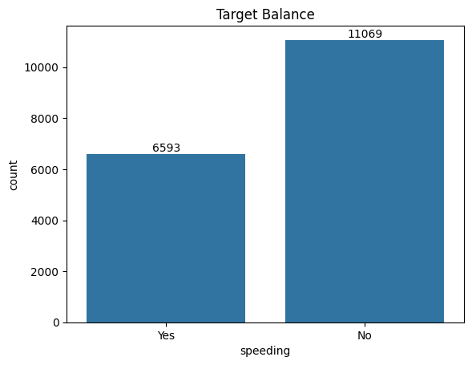

## Capstone Project: Predicting Speeding from Open Street Maps and Telematics Data

**Professional Certificate in Machine Learning and Artificial Intelligence** 
**Jeremy Stairs** 
**July 2024**
 
 

### Executive summary
This project uses Open Street Maps (OSM) data with fleet vehicle data to predict if a driver is speeding in each driving report. Using OSM data, the cost per report will be much lower than the paid mapping services. Unfortunately, OSM is far from complete. Many requests are returned with no speed limit. It's difficult to predict the speed limit in a specific location using just OSM data. However, we might be able to use OSM data along with the known vehicle speed to predict if the driver is speeding. It's unlikely that the error will be low enough to reliably send an alert to the user. Still, this prediction can idicate potential speeding. If speeding is likely, we can perform more accurate and costly speed limit queries. Ultimately, it's important that we catch each instance of speeding to ensure driver safety for all of our customers.
 
 

### Rationale
As a fleet telematics company, our customers reqire alerts when drivers are speeding. Vehicle speed is included in each vehicle report. However, there are few complete speed limit databases. None are free. The Open Street Map project includes speed limits, but this only covers about 12% of its roads. Until the crowd-sourced database is complete, a model for predicting when a driver is speeding would allow us to reduce costs while still providing our customers with alerts needed to ensure fleet vehicles are driven safely.
 
 

### Research Question
Can telematics data and Open Street maps data be used to determine if a driver is speeding?

Note: My original question asked if the speed limit could be predicted from OSM data. Early testing showed scores under 0.3. This was possibly due to the target being multilabel with over 10 different labels. I decided to refoucus the question to determine when vehicles were driven over the posted speed limit. Thas has a simiple yes/no target and is very relavent to our company's speed limit alert serivce.
 
 

### Data Sources
This project has two data sources:
- Fleet telematics data
- Open Street Maps (OSM) tag data

Speed limits and associated mapping data are publicly available from the Open Street Map (OSM) project. There are mapping files with varying levels of granularity (continent, country, state). The files can be uncompressed and imported to a PostgreSQL server. The compressed mapping files for the entire world are about 100 GB which require about 1TB of database space. We have a server with full mapping data for the continental US.

OSM Wiki: https://wiki.openstreetmap.orgLinks to an external site.

OSM mapping files: https://download.geofabrik.de/

Our units in the field report telematics data periodically while moving. This data is combined with data from OSM based on the vehicle location. I extracted data for several days of reporting when both vehicle speed and OSM speed limit were included. The data was unaltered expect for the 'speeding' column which was derived from the posted speed limit and the vehicle speed.

The dataset contains eight features and one target:

- normalizedSpeed - vehicle speed normalized to miles per hour
- lanes - number of lanes traveling in the same direction
- oneway - indicates if the OSM way only allows travel in one directions, possible values: yes, no, reversible, alternating
- surface - the phyical surface of the OSM way
- hgv - indicates conditions for heavy good vehicles
- foot - indicates if pedestrian foot traffic is allowed
- horse - indicates if equestrians are allowed
- bicycle - indicates if bicyclists are allowed
- speeding - target - if 'yes', the vehicle speed was greater than posted speed limit, otherwise 'no'

 

### Methodology
Overall, the project follows the Data Science Life Cycle (DSLC).

**Data Cleaning** 
Feature examination exposed several changes needed during data cleaning:
- 'lanes' were cast from an object to a numerical feature
- 'oneway' had the values '-1' changed to 'reversible'
- 'horse' had the value 'no '' converted to 'no'
- the features 'oneway', 'surface', and 'hgv' were converted to numerical features using one-hot encoding
- the features 'foot', 'horse', and 'bicycle' were converted to numerical features using binary encoding

**Modeling** 
In the modeling phase, four classifiers were used:

- Logistic Regression
- K-Nearest Neighbors
- Decision Tree
- Support Vecor Machine

Ensamble techniques random forest and AdaBoost were also used.

A baseline was be set using LogisticRegression with default settings. Further modeling of the classifiers above was performed with default parameters. Thorough hyperparameter tuning was performed using grid search.
 
 

### Results

The target of our data set is imbalance nearly 2 to 1. This imbalance makes accuracy a bad evaluation metric. We considered the metrics precision and recall. Precision minimizes false positives. This favors models that catch only some speeders, but is unlikely to classify a non-speeder incorrectly. Models with high recall scores will be more likely to catch all speeders, but some non-speeders will be incorrectly classified as speeding. We measured both metrics for the baseline and default models.

The baseline score with a default logistic regression model had scores:
 Train Precision | Test Precision | Train Recall | Test Recall
---:|:---:|:---:|:---
0.7047 | 0.6849 | 0.7267 | 0.7498
#### Default model performance:

Model | Training Time (ms) | Train Precision | Test Precision | Train Recall | Test Recall
---:|:---:|:---:|:---:|:---:|:---
**Logistic Regression** | 16.0 | 0.7047 | 0.6849 | 0.7267 | 0.7498
**K-Nearest Neighbors** | 8.0 | 0.7961 | 0.6555 | 0.7683 | 0.6646
**Decision Tree** | 19.0 | 0.9133 | 0.5964 | 0.7130 | 0.5414
**Support Vector Machine** | 1464.0 | 0.7250 | 0.6977 | 0.7074 | 0.7334

Logistic regression had a higher recall score. SVC had a higher precision score, but the train time for SVC was much longer.

#### Tuned model performance:

Considering the test scores for the default models, it's unlikely that the models can be used as the only source to determine if the vehicle was speeding. However, we could use model to find potential speeding vehicles. Recall was used to evaluate the tuned models. This made the models more likely to find all speeding vehciles. Readings that are classified as speeding can be sent to a more accurate, but more expensive, speed limit service.

Model | Training Time (ms) | Training Recall | Test Recall
---:|:---:|:---:|:---
**Logistic Regression** | 14 | 0.8473 | 0.8680
**K-Nearest Neighbors** | 16 | 0.7301 | 0.7069
**Decision Tree** | 18 | 0.7232 | 0.6930
**Support Vector Machine** | 1318 | 0.7333 | 0.7599

With hyperparameter tuning, the logistic regression model had the best score.

To explore ensamble techniques, a random forest classifier and AdaBoost classifier are selected using grid search. The AdaBoost classifier use a logistic regression estimator.

Model | Training Time (ms) | Training Recall | Test Recall
---:|:---:|:---:|:---
**Random Forest** | 397 | 0.8924 | 0.9015
**AdaBoost** | 499 | 0.9116 | 0.9191

Both ensamble techniques performed better than any of the tuned models. The AdaBoost classifier using a logistic regression estimator performed slightly better than the random forest.
 
 

### Next steps
The test scores show that ML modeling is a viable way to predict events when the driver is over the posted speed limit. Ensamble techniques brought the recall score over 0.9. Although this is still too low to use the model as the sole source for identifying speeding, it can used with a speed limit API to reduce error to nearly zero while cutting API costs considerably.

Future work will include model selection, deployment, and testing. We might also be able to interpolate some missing feature data to increase the data set size and make the service more generally useful. As the OSM database becomes more complete, model error should continue to drop. We might eventually be able to use the model as the sole source to find speeders reducing API costs further.
 
 

### Outline of project
Detailed finding can be found in this Jupyter Notebook: [capstone.ipynb](https://github.com/jeremystairs/UCB-MLAI-Capstone/blob/main/capstone.ipynb)

Initial data: [data](https://github.com/jeremystairs/UCB-MLAI-Capstone/tree/main/data)

Images generated during analysis: [images](https://github.com/jeremystairs/UCB-MLAI-Capstone/tree/main/images)
 
 

### Contact and Further Information
Please contact me through the comments section of this project.